  &nbsp;
  &nbsp;
  

 

Soy **Iván**, tengo 27 años, nací en **Paraguay** y vivo en **Madrid**. Estoy cursando el **Grado Superior en Desarrollo de Aplicaciones Multiplataforma (FP DAM) en Ilerna, Madrid** y escribo mis primeros programas en **Java**.

Me interesa entender cómo funciona todo por dentro: variables, tipos de datos, flujos de entrada… y también cómo la **inteligencia artificial** acelera el aprendizaje. Uso la **IA** como compañera de proyectos para diseñar, revisar y entender cada línea de código.

 

Integro la inteligencia artificial en mi forma de trabajar: uso **Claude**, **ChatGPT**, **IntelliJ**, **Visual Studio** y **opencode** para planificar, escribir, comentar y depurar código, entender documentación y convertir errores en lecciones. **La IA no sustituye mi aprendizaje — lo acelera.**

`Planificación de ejercicios` · `Code review` · `Explicación de errores` · `Documentación` · `Generación de proyectos web`

 

<table>
  <tr>
    <td width="50%" valign="top">
      
      <h3>Servitek-web</h3>
      Sitio corporativo de SERVITEK E.A.S., electromecánica industrial en Paraguay. Next.js 14, TypeScript estricto, Tailwind y CI con GitHub Actions.
        
      <a href="https://servitek.pages.dev"><b>Sitio en vivo ↗</b></a>&nbsp;&nbsp;·&nbsp;&nbsp;<a href="https://github.com/ivanvera7/servitek-web">Ver repo</a>
    </td>
    <td width="50%" valign="top">
      
      <h3>Solca Decoraciones</h3>
      Web para una empresa de decoraciones en Paraguay. Ya publicada y en línea.
        
      <a href="https://solca-decoraciones.vercel.app"><b>Sitio en vivo ↗</b></a>&nbsp;&nbsp;·&nbsp;&nbsp;<a href="https://github.com/ivanvera7/Solca-decoraciones">Ver repo</a>
    </td>
  </tr>
</table>

#### Ejercicios de Java

| | Ejercicio | Qué practico | Código |
| :-: | --- | --- | --- |
| `01` | **Hola Mundo** | El primer programa: imprime mi nombre y mi propósito de aprendizaje en consola. | [repo ↗](https://github.com/ivanvera7/Ejercicio1-HolaMundo) |
| `02` | **Variables** | Tipos de datos `String`, `int` y `double`, y concatenación de texto. | [repo ↗](https://github.com/ivanvera7/Ejercicio2-Variables) |
| `03` | **Sumar** | Operadores aritméticos: almaceno dos números y muestro el resultado de la suma. | [repo ↗](https://github.com/ivanvera7/Ejercicio3-Sumar) |
| `04` | **Calculadora** | Las cuatro operaciones básicas sobre los mismos números: suma, resta, multiplicación y división. | [repo ↗](https://github.com/ivanvera7/Ejercicio4-Calculadora) |
| `05` | **Info de usuario** | Entrada de teclado con `java.util.Scanner`: leo un nombre y respondo con un saludo. | [repo ↗](https://github.com/ivanvera7/Ejercicio5-Info-de-usuario) |

> [!TIP]
> Los cinco se pueden **ejecutar en mi web**: cada uno escribe `java Main.java` y muestra su salida real, y el de `Scanner` te pregunta tu nombre → [ivanvera7.github.io/Ivanvera-web/#proyectos](https://ivanvera7.github.io/Ivanvera-web/#proyectos)

 

Escríbeme por cualquiera de estos canales. **Disponible para proyectos · Madrid, ES.**

  &nbsp;
  &nbsp;
  &nbsp;
  

 

  
  

 

